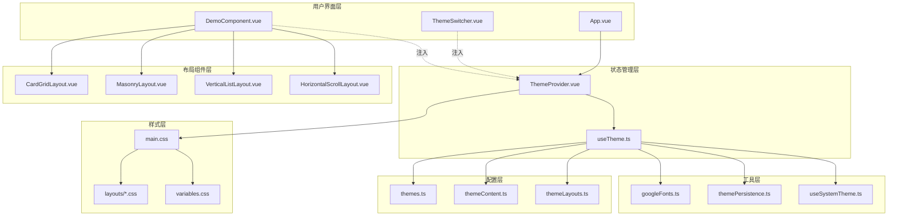
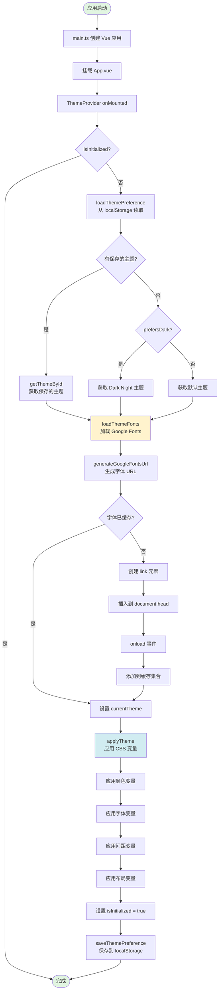
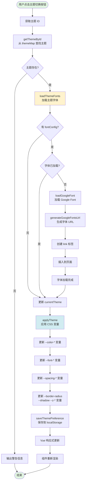
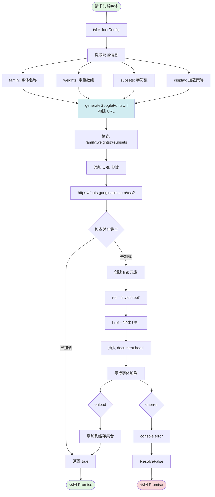
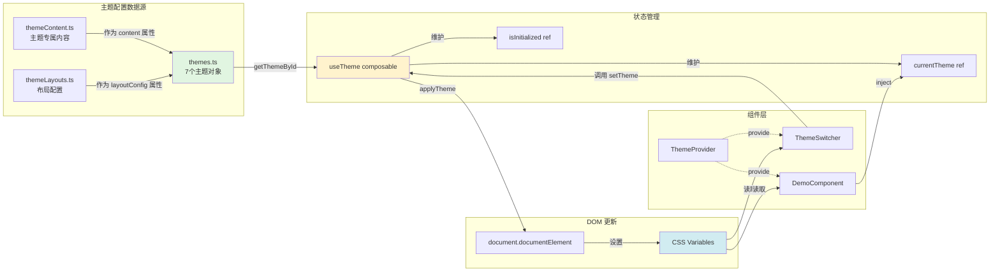

# Vue 主题系统架构文档

本文档提供了 Vue 3 主题系统的完整架构说明，包括系统组成、数据流程和交互关系。

## 目录

- [系统整体架构](#1-系统整体架构图)
- [主题初始化流程](#2-主题初始化流程图)
- [主题切换流程](#3-主题切换流程图)
- [字体加载机制](#4-字体加载流程图)
- [布局组件切换](#5-布局组件切换流程图)
- [数据流关系](#6-数据流图)
- [主题配置概览](#主题配置概览)
- [使用指南](#使用指南)

---

## 1. 系统整体架构图

系统采用分层架构，从上到下分为用户界面层、状态管理层、配置层、工具层、布局组件层和样式层。



### 架构说明

| 层级 | 职责 | 主要文件 |
|------|------|----------|
| 用户界面层 | 用户交互和视图展示 | App.vue, ThemeSwitcher.vue, DemoComponent.vue |
| 状态管理层 | 主题状态管理和逻辑控制 | ThemeProvider.vue, useTheme.ts |
| 配置层 | 主题数据和配置定义 | themes.ts, themeContent.ts, themeLayouts.ts |
| 工具层 | 辅助功能和工具函数 | googleFonts.ts, themePersistence.ts, useSystemTheme.ts |
| 布局组件层 | 可复用的布局组件 | CardGridLayout.vue, MasonryLayout.vue 等 |
| 样式层 | 全局样式和主题变量 | main.css, layouts/*.css, variables.css |

---

## 2. 主题初始化流程图

应用启动时，主题系统会自动初始化，加载用户之前保存的主题偏好或选择默认主题。



### 初始化流程说明

1. **应用启动**: main.ts 创建 Vue 应用实例并挂载 App.vue
2. **主题提供者挂载**: ThemeProvider 的 onMounted 钩子触发初始化
3. **加载偏好设置**: 从 localStorage 读取用户保存的主题 ID
4. **智能默认**: 如果没有保存的主题，检查系统是否偏好深色模式
5. **字体加载**: 异步加载主题配置的 Google Fonts
6. **应用主题**: 设置 CSS 变量到 document.documentElement
7. **完成标记**: 设置 isInitialized = true，防止重复初始化

---

## 3. 主题切换流程图

用户通过 ThemeSwitcher 组件切换主题时的完整流程。



### 切换流程说明

1. **用户交互**: 点击 ThemeSwitcher 中的主题按钮
2. **主题查找**: 通过 getThemeById 从 themeMap 获取主题配置
3. **字体预加载**: 如果新主题使用不同的字体，先加载字体
4. **应用样式**: 更新 CSS 变量，立即生效
5. **持久化**: 保存用户选择到 localStorage
6. **响应式更新**: Vue 的响应式系统自动更新所有依赖组件

---

## 4. 字体加载流程图

Google Fonts 动态加载机制，包含缓存优化和错误处理。



### 字体加载机制

| 特性 | 说明 |
|------|------|
| **动态构建 URL** | 根据字体名称、字重、字符集生成 Google Fonts URL |
| **缓存优化** | 使用 Set 记录已加载字体，避免重复加载 |
| **异步加载** | 返回 Promise，支持 async/await |
| **错误处理** | 捕获加载失败，防止阻塞应用 |
| **加载策略** | 支持 swap、block、fallback、display 等策略 |

### 字体 URL 格式

```
https://fonts.googleapis.com/css2?family=Inter:wght@400;500;600;700&display=swap
```

---

## 5. 布局组件切换流程图

根据主题配置动态选择和渲染不同的布局组件。

```mermaid
flowchart TD
    Start([DemoComponent 渲染]) --> InjectTheme[注入 currentTheme]

    InjectTheme --> GetLayout[获取 layoutConfig]
    GetLayout --> Pattern[pattern: 布局模式]

    Pattern --> LookupLayout[查找 layoutComponents 映射]
    LookupLayout --> Select{选择布局组件}

    Select -->|card-grid| CardGrid[CardGridLayout.vue]
    Select -->|masonry| Masonry[MasonryLayout.vue]
    Select -->|vertical-list| VerticalList[VerticalListLayout.vue]
    Select -->|horizontal-scroll| HorizontalScroll[HorizontalScrollLayout.vue]
    Select -->|bento-box| CardGrid
    Select -->|compact-list| VerticalList

    CardGrid --> DynamicComp
    Masonry --> DynamicComp
    VerticalList --> DynamicComp
    HorizontalScroll --> DynamicComp

    DynamicComp[<br/><br/>component :is="layoutComponent"<br/>动态组件渲染<br/><br/>]
    DynamicComp --> PassProps[传递 props]
    PassProps --> LayoutConfig[layoutConfig]
    PassProps --> CustomClasses[customClasses]

    LayoutConfig --> ApplyGrid[应用网格配置]
    CustomClasses --> ApplyStyles[应用自定义样式]

    ApplyGrid --> Columns[columns: 列数]
    ApplyGrid --> Gap[gap: 间距]
    ApplyGrid --> MinWidth[minItemWidth: 最小宽度]

    ApplyStyles --> Container[container 类名]
    ApplyStyles --> Section[section 类名]
    ApplyStyles --> Card[card 类名]

    Columns --> RenderSlot
    Gap --> RenderSlot
    MinWidth --> RenderSlot
    Container --> RenderSlot
    Section --> RenderSlot
    Card --> RenderSlot

    RenderSlot[渲染 slot 内容]
    RenderSlot --> Features[Features 卡片]
    RenderSlot --> Examples[Examples 卡片]
    RenderSlot --> Colors[Color Palette]

    Features --> End([完成渲染])
    Examples --> End
    Colors --> End

    style Start fill:#e1f5e1
    style End fill:#e1f5e1
    style DynamicComp fill:#d1ecf1
```

### 布局组件映射

| Pattern | 组件 | 用途 |
|---------|------|------|
| `card-grid` | CardGridLayout.vue | 网格卡片布局 |
| `masonry` | MasonryLayout.vue | 瀑布流布局 |
| `vertical-list` | VerticalListLayout.vue | 垂直列表布局 |
| `horizontal-scroll` | HorizontalScrollLayout.vue | 水平滚动布局 |
| `bento-box` | CardGridLayout.vue | Bento 盒式布局（复用网格） |
| `compact-list` | VerticalListLayout.vue | 紧凑列表（复用垂直列表） |

---

## 6. 数据流图

展示主题数据在系统各层之间的流动和组件间的依赖关系。



### 数据流说明

1. **配置数据**: 主题配置文件是只读数据源
2. **状态提升**: useTheme composable 集中管理主题状态
3. **依赖注入**: ThemeProvider 通过 provide/inject 向下传递状态
4. **样式同步**: CSS 变量设置到根元素，所有组件自动生效
5. **单向数据流**: 用户操作 → 组件事件 → 状态更新 → DOM 更新

---

## 主题配置概览

### 可用主题列表

| ID | 名称 | 描述 | 主色调 |
|----|------|------|--------|
| `default` | Default | 默认主题，现代简洁 | 蓝色 |
| `dark-night` | Dark Night | 深色护眼主题 | 深灰 |
| `ocean-breeze` | Ocean Breeze | 海洋风，清新自然 | 青色 |
| `sunset-warm` | Sunset Warm | 日落暖色，温馨舒适 | 橙色 |
| `forest-zen` | Forest Zen | 森林禅意，宁静平和 | 绿色 |
| `royal-purple` | Royal Purple | 皇家紫气，尊贵典雅 | 紫色 |
| `cherry-blossom` | Cherry Blossom | 樱花粉嫩，柔美浪漫 | 粉色 |

### 主题配置结构

```typescript
interface Theme {
  id: string                    // 主题唯一标识
  name: string                  // 主题显示名称
  description: string           // 主题描述
  colors: ThemeColors          // 颜色配置
  typography: ThemeTypography  // 字体配置
  spacing: ThemeSpacing        // 间距配置
  layout: ThemeLayout          // 布局配置
  content?: ThemeContent       // 主题专属内容
}
```

### CSS 变量命名规范

| 类别 | 前缀 | 示例 |
|------|------|------|
| 颜色 | `--color-` | `--color-primary`, `--color-background` |
| 字体 | `--font-` | `--font-family`, `--font-size-base` |
| 间距 | `--spacing-` | `--spacing-xs`, `--spacing-md` |
| 边框 | `--border-` | `--border-radius`, `--border-color` |
| 阴影 | `--shadow-` | `--shadow-sm`, `--shadow-lg` |
| 层级 | `--z-` | `--z-dropdown`, `--z-modal` |

---

## 使用指南

### 在组件中使用主题

```vue
<script setup lang="ts">
import { inject } from 'vue'

// 注入当前主题
const currentTheme = inject<Ref<Theme>>('currentTheme')

// 访问主题配置
const primaryColor = computed(() => currentTheme.value.colors.primary)
</script>

<template>
  <div :style="{ color: primaryColor }">
    {{ currentTheme.name }}
  </div>
</template>
```

### 切换主题

```vue
<script setup lang="ts">
import { useTheme } from '@/composables/useTheme'

const { setTheme } = useTheme()

// 切换到指定主题
const switchToDarkNight = () => {
  setTheme('dark-night')
}
</script>
```

### 创建自定义主题

在 `src/config/themes.ts` 中添加新主题：

```typescript
export const myCustomTheme: Theme = {
  id: 'my-custom',
  name: 'My Custom Theme',
  description: 'My personalized theme',
  colors: {
    primary: '#3b82f6',
    // ... 其他颜色
  },
  typography: {
    fontFamily: 'Inter, sans-serif',
    // ... 其他字体配置
  },
  // ... 其他配置
}

// 添加到 themeMap
export const themeMap: Record<string, Theme> = {
  // ... 现有主题
  'my-custom': myCustomTheme,
}
```

---

## 相关文件

```
src/
├── config/
│   ├── themes.ts              # 主题配置定义
│   ├── themeContent.ts        # 主题专属内容
│   └── themeLayouts.ts        # 布局配置
├── composables/
│   └── useTheme.ts            # 主题管理 composable
├── utils/
│   ├── googleFonts.ts         # Google Fonts 加载
│   ├── themePersistence.ts    # 主题持久化
│   └── useSystemTheme.ts      # 系统主题检测
├── providers/
│   └── ThemeProvider.vue      # 主题提供者
├── components/
│   ├── ThemeSwitcher.vue      # 主题切换器
│   └── DemoComponent.vue      # 演示组件
└── layouts/
    ├── CardGridLayout.vue     # 网格布局
    ├── MasonryLayout.vue      # 瀑布流布局
    ├── VerticalListLayout.vue # 垂直列表布局
    └── HorizontalScrollLayout.vue # 水平滚动布局
```

---

## 技术栈

- **Vue 3**: Composition API, provide/inject
- **TypeScript**: 类型安全
- **Vite**: 构建工具
- **Google Fonts**: Web 字体加载
- **CSS Variables**: 动态主题样式

---

## 维护指南

### 添加新主题步骤

1. 在 `themes.ts` 中定义主题对象
2. 添加到 `themeMap` 导出对象
3. （可选）在 `themeContent.ts` 中添加专属内容
4. （可选）在 `themeLayouts.ts` 中配置布局
5. 在 `ThemeSwitcher.vue` 中添加切换按钮

### 调试技巧

- 打开浏览器开发者工具 → Elements → Styles
- 查看 `:root` 下的 CSS 变量值
- 使用 Vue Devtools 检查 `currentTheme` 状态
- 查看 Console 中的字体加载日志

---

**文档版本**: 1.0.0
**最后更新**: 2026-02-15
